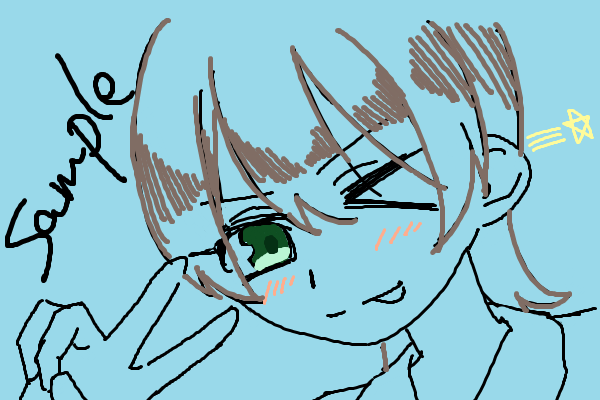
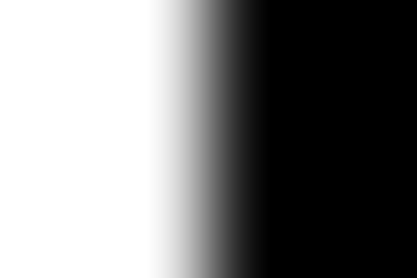
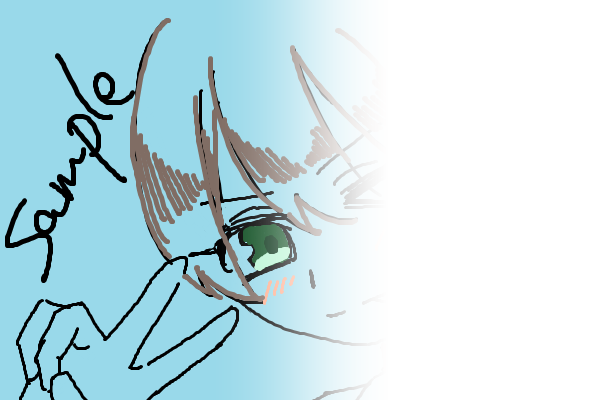

# sharp-utils
Node.jsの画像処理モジュールである[sharp](https://www.npmjs.com/package/sharp)のプラグイン的なモジュールです。

[](https://badge.fury.io/js/sharp-utils)

## Installation
```
npm i sharp-utils
```

## Documentation
[ドキュメント](./docs/modules.md)

## Examples

### circle
円の画像を生成します。

### rect
長方形の画像を生成します。

### roundedRect
角丸の長方形の画像を生成します。

### regularPolygon
正多角形の画像を生成します。

### mask
画像にマスク処理をします。
グレースケール化されたマスク画像の深度(0-255)を参照して、対称の画像の透明度を変更します。


*sample.png*


*mask.png*

```ts
import sharp from "sharp"
import { mask } from "sharp-utils"

let sampleImage = sharp("sample.png")
let maskImage = sharp("mask.png")

mask(sampleImage, maskImage).then(maskedImage => {
    maskedImage.toFile("masked.png")
})
```

#### 結果

*masked.png*


<script src="https://blz-soft.github.io/md_style/release/v1.2/md_style.js" ></script>