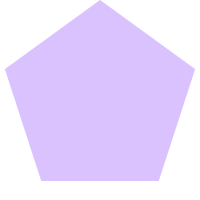
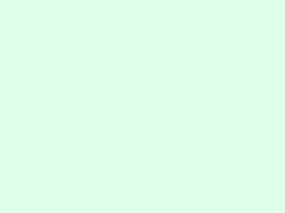
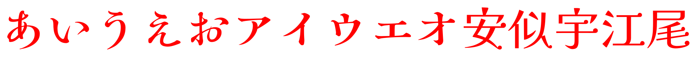

# sharp-utils
Node.jsの画像処理モジュールである[sharp](https://www.npmjs.com/package/sharp)のプラグイン的なモジュールです。

[](https://badge.fury.io/js/sharp-utils)

## Installation
```
npm i sharp-utils
```

## Documentation
その他細かいことは[ドキュメント](./docs/modules.md)を見て頂ければと思います。

## Examples

### import

```ts
import sharp from "sharp"
import { ... } from "sharp-utils" // import any function
```

### circle
円の画像を生成します。

```ts
circle(100, {
    fill: {
        color: "tomato"
    },
    stroke: {
        color: "aqua",
        width: 20,
    }
}).toFile("circle.png")
```

#### 結果
*circle.png*


### rect
長方形の画像を生成します。

```ts
rect(300, 200, {
    fill: {
        color: "#99d9ea"
    }
}).toFile("rect.png")
```

#### 結果
*rect.png*


### roundedRect
角丸の長方形の画像を生成します。

```ts
roundedRect(300, 200, 20, {
    fill: {
        color: "#99d9ea"
    }
}).toFile("roundedRect.png")
```

#### 結果
*roundedRect.png*


### regularPolygon
正多角形の画像を生成します。

```ts
regularPolygon(5, 100, {
    fill: {
        color: "#dac2ff"
    }
}).toFile("regularPolygon.png")
```

#### 結果
*regularPolygon.png*



### createImage
空の画像を生成します。

```ts
createImage(400, 300, {
    r: 223, 
    g: 255, 
    b: 235,
    alpha: 1
}).toFile("createImage.png")
```

#### 結果
*createImage.png*



### mask
画像にマスク処理をします。
グレースケール化されたマスク画像の深度(0-255)を参照して、対称の画像の透明度を変更します。

*sample.png*


*mask.png*


```ts
let sampleImage = sharp("sample.png")
let maskImage = sharp("mask.png")

mask(sampleImage, maskImage).then(maskedImage => {
    maskedImage.toFile("masked.png")
})
```

#### 結果
*masked.png*


### TextToImage
ほぼ[text-to-svg](https://www.npmjs.com/package/text-to-svg)です。
元パッケージの仕様通り、ローカルのフォントを読み込んで画像出力できます。
オプションの仕様も同じです。

```ts
let text = new TextToImage("/fonts/KaiseiHarunoUmi-Regular.ttf", {
    fontSize: 120,
    attributes: {
        fill: "red"
    }
})

// 画像出力
text.getSharp("あいうえおアイウエオ安似宇江尾").toFile("font.png")
```

#### 結果
*font.png*

